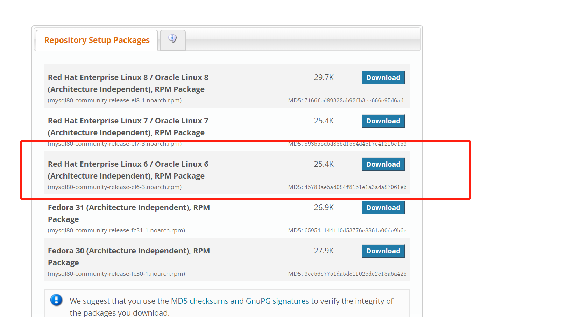

### 【mysql】mysql安装[链接](https://www.jianshu.com/p/b5a265050885)

### Mysql Yum源码安装
> 官网[地址](https://dev.mysql.com/downloads/repo/yum/)

#### 1.查看Linux系统版本
> `cat /etc/redhat-release`
```
[root@Centos02 /]# cat /etc/redhat-release
CentOS release 6.10 (Final)
```

#### 2.下载`Linux 6`版本


#### 3.上传至`/opt`文件目录
```
[root@Centos02 opt]# rz -bye

[root@Centos02 opt]# ll
total 32
-rw-r--r--. 1 root root 26012 Jan 26 21:37 mysql80-community-release-el6-3.noarch.rpm
drwxr-xr-x. 2 root root  4096 Oct  4  2017 rh
```

#### 4.安装rpm包
> `rpm -Uvh mysql80-community-release-el6-3.noarch.rpm`
> 
> 查看安装版本: `yum list |grep mysql`
>
> 当前机器版本: `mysql-community-server.x86_64  8.0.19-1.el6`
```
[root@Centos02 opt]# rpm -Uvh mysql80-community-release-el6-3.noarch.rpm
warning: mysql80-community-release-el6-3.noarch.rpm: Header V3 DSA/SHA1 Signature, key ID 5072e1f5: NOKEY
Preparing...                ########################################### [100%]
   1:mysql80-community-relea########################################### [100%]
[root@Centos02 opt]# yum list |grep mysql
mysql.x86_64                               5.1.73-8.el6_8                @anaconda-CentOS-201806291108.x86_64/6.10
mysql-libs.x86_64                          5.1.73-8.el6_8                @anaconda-CentOS-201806291108.x86_64/6.10
mysql-server.x86_64                        5.1.73-8.el6_8                @anaconda-CentOS-201806291108.x86_64/6.10
mysql80-community-release.noarch           el6-3                         installed
qt-mysql.x86_64                            1:4.6.2-28.el6_5              @anaconda-CentOS-201806291108.x86_64/6.10
apr-util-mysql.x86_64                      1.3.9-3.el6_0.1               base   
bacula-director-mysql.x86_64               5.0.0-13.el6                  base   
bacula-storage-mysql.x86_64                5.0.0-13.el6                  base   
......
mysql-community-server.x86_64              8.0.19-1.el6                  mysql80-community
mysql-community-test.x86_64                8.0.19-1.el6                  mysql80-community
mysql-connector-c++.x86_64                 8.0.19-1.el6                  mysql-connectors-community
mysql-connector-c++-debuginfo.x86_64       8.0.19-1.el6                  mysql-connectors-community
```

#### 5.选择固定版本安装[链接](https://dev.mysql.com/doc/mysql-yum-repo-quick-guide/en/)
* 1.关闭MySQL 8.0 Community Server版本 `yum-config-manager --disable mysql80-community`
* 2.启用MySQL 5.6 Community Server版本 `yum-config-manager --enable mysql56-community`
```
[root@Centos02 opt]# yum repolist all | grep mysql
......
mysql55-community                  MySQL 5.5 Community Server     disabled
mysql55-community-source           MySQL 5.5 Community Server - S disabled
mysql56-community                  MySQL 5.6 Community Server     disabled
mysql56-community-source           MySQL 5.6 Community Server - S disabled
mysql57-community                  MySQL 5.7 Community Server     disabled
mysql57-community-source           MySQL 5.7 Community Server - S disabled
mysql80-community                  MySQL 8.0 Community Server     enabled:   141
mysql80-community-source           MySQL 8.0 Community Server - S disabled

[root@Centos02 opt]# yum-config-manager --disable mysql80-community
[root@Centos02 opt]# yum-config-manager --enable mysql56-community
[root@Centos02 opt]# yum repolist all | grep mysql
......
mysql55-community                  MySQL 5.5 Community Server     disabled
mysql55-community-source           MySQL 5.5 Community Server - S disabled
mysql56-community                  MySQL 5.6 Community Server     enabled:   568
mysql56-community-source           MySQL 5.6 Community Server - S disabled
mysql57-community                  MySQL 5.7 Community Server     disabled
mysql57-community-source           MySQL 5.7 Community Server - S disabled
mysql80-community                  MySQL 8.0 Community Server     disabled
mysql80-community-source           MySQL 8.0 Community Server - S disabled
```

#### 6.安装`mysql-community-server.x86_64`版本
> `yum -y install mysql-community-server.x86_64`
```
[root@Centos02 opt]# yum -y install mysql-community-server.x86_64
......
[root@Centos02 opt]# echo $?
0
```

#### 7.安装完成后需要初始化数据库
> `/etc/init.d/mysqld start`
```
[root@Centos02 opt]# /etc/init.d/mysqld start
......
  /usr/bin/mysqladmin -u root password 'new-password'
  /usr/bin/mysqladmin -u root -h Centos02 password 'new-password'

.....
WARNING: Default config file /etc/my.cnf exists on the system
This file will be read by default by the MySQL server
If you do not want to use this, either remove it, or use the
--defaults-file argument to mysqld_safe when starting the server [  OK  ]
Starting mysqld:   [  OK  ]
[root@Centos02 opt]# echo $?
0
```

#### 8.初始化成功按照提示我们开始设置密码
> `/usr/bin/mysqladmin -u root password 'root123'`
>
> `Warning: Using a password on the command line interface can be insecure.` 警告：在命令行界面上使用密码可能不安全。忽略警告。
```
[root@Centos02 opt]# /usr/bin/mysqladmin -u root password 'root123'
Warning: Using a password on the command line interface can be insecure.
```

#### 9.登录`Mysql`
> `mysql -u root -p'root123'`
```
[root@Centos02 opt]# mysql -u root -p'root123'
Warning: Using a password on the command line interface can be insecure.
Welcome to the MySQL monitor.  Commands end with ; or \g.
Your MySQL connection id is 3
Server version: 5.6.47 MySQL Community Server (GPL)

Copyright (c) 2000, 2020, Oracle and/or its affiliates. All rights reserved.

Oracle is a registered trademark of Oracle Corporation and/or its
affiliates. Other names may be trademarks of their respective
owners.

Type 'help;' or '\h' for help. Type '\c' to clear the current input statement.

mysql> show databases;
+--------------------+
| Database           |
+--------------------+
| information_schema |
| mysql              |
| performance_schema |
+--------------------+
3 rows in set (0.01 sec)

mysql> exit
Bye
```
